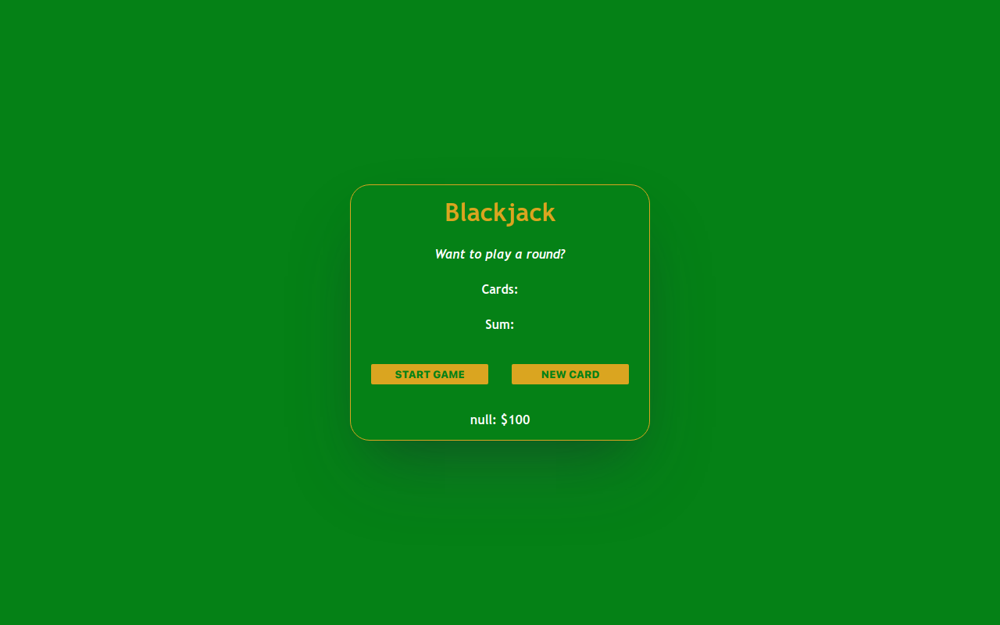

# Blackjack Game

## Overview

Welcome to the Blackjack Game project! This interactive web application lets users play the classic game of Blackjack. Built with HTML, CSS, and JavaScript, the project brings the thrill of the casino to your browser.

### Table of Contents

- [Installation](#installation)
- [How to use](#how-to-use)
- [Technologies Used](#technologies-used)
- [Features](#features)
- [Project Structure](#project-structure)
- [Credits](#credits)
- [License](#license)



## Installation

To run this project locally, follow these steps:

1. Clone the repository to your local machine.
    ```bash
    git clone https://github.com/m-ramzan786/Blackjack-Game.git
    ```

2. Open the project folder in your code editor.

3. Open the `index.html` file in your web browser.

## How to Use

To use the Blackjack Game:

1. Open the [live demo](https://blackjack-game-liard.vercel.app/) or run it locally.

2. Enter your name when prompted by the browser.

3. Click the "Start Game" button to begin the Blackjack game.

4. Use the "New Card" button to draw additional cards.

5. See the game status and final result after each round.

6. Continue playing to improve your Blackjack skills!

## Technologies Used

- HTML
- CSS
- JavaScript

## Features

- **Player Name Entry:** When opening the game, the browser prompts the user to enter their name, which is displayed under the game buttons.

- **Game Start and New Card Buttons:** Start the game and draw new cards with the respective buttons.

- **Scoring System:** Track your wins, losses, and ties throughout the game.

- **Game Logic:** Win the game if the score is 21 or lose if it exceeds 21. The player can continue drawing new cards until reaching a winning or losing condition.

- **User-Friendly Interface:** Simple design for ease of use.

- **Responsive:** Responsive design for various screen sizes.

## Project Structure

The project is organized for easy navigation and features a clean and visually appealing design.

## Credits

This project was developed with the support of [Scrimba](https://scrimba.com/), an interactive learning platform for web development.

## License

This project is licensed under the [MIT License](LICENSE). Feel free to use and modify the code as per the license terms.

## Badges


## How to Contribute

If you'd like to contribute to the project, follow these steps:

1. Fork the project.
2. Create a new branch for your feature: `git checkout -b feature-name`.
3. Commit your changes: `git commit -m 'Add new feature'`.
4. Push to the branch: `git push origin feature-name`.
5. Open a pull request.

## Contact

If you have any questions, suggestions, or just want to connect, feel free to reach out:

- Email: [mramzanstv@gmail.com](mramzanstv@gmail.com)
- Portfolio: [Muhammad-Ramzan-Portfolio](https://muhammad-ramzan.vercel.app/)
- LinkedIn: [in/m-ramzan786](https://www.linkedin.com/in/m-ramzan786/)

## Tests

The project includes a set of tests to ensure the functionality is working as expected. To run the tests, use the following command:
```bash
npm test
```

Enjoy the game and good luck at the Blackjack table!
